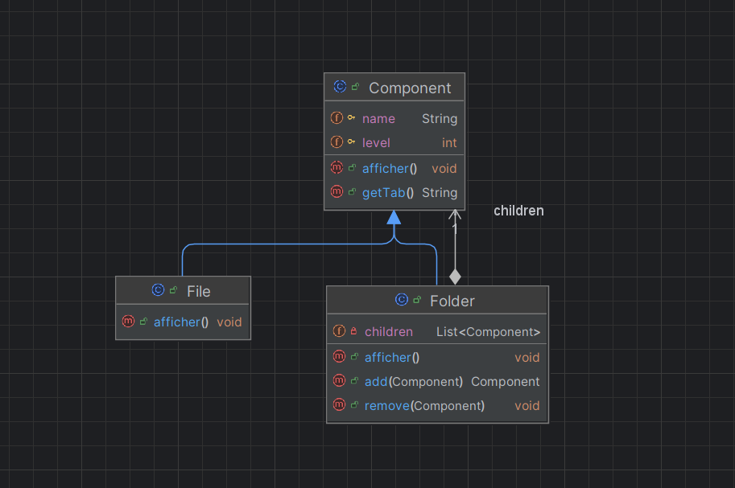

# Design Pattern Composite

## 📚 Description

Le **design pattern Composite** est un patron de conception structurel qui permet de composer des objets en
structures arborescentes pour représenter des hiérarchies **partie-tout**. 
Il permet de traiter de manière uniforme les objets simples (feuilles) et les objets composites (conteneurs).

---

## 🔑 Structure

Le diagramme suivant montre la structure du pattern Composite :

1. **Component** : Interface ou classe abstraite qui définit les opérations communes.
2. **File (Leaf)** : Représente un objet simple (fichier).
3. **Folder (Composite)** : Représente un conteneur qui peut inclure des feuilles ou d'autres composites.

